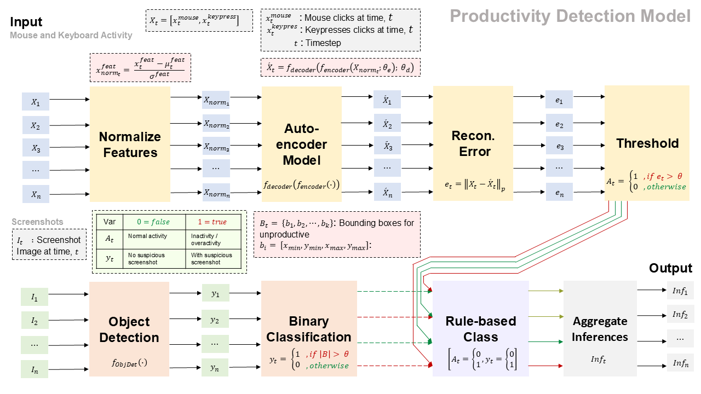
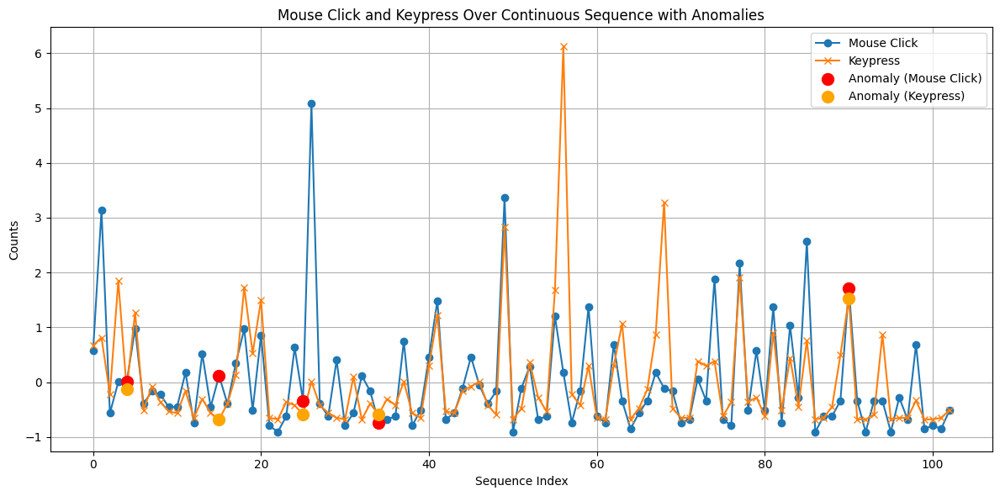
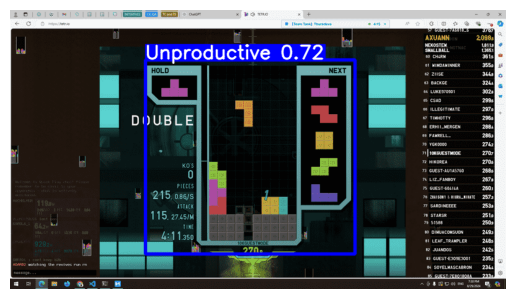

# Unproductivity Detection Model

This project implements a hybrid deep learning pipeline to detect **user productivity or unproductivity** based on a combination of:

- **Mouse and keyboard activity**
- **Screenshot-based object detection**
- **Rule-based logical inference**

The model is particularly useful in BPO, software development, or online education environments to infer user engagement across time, without explicitly monitoring personal data.

---

## Architecture Overview

---

## Pipeline Summary

### 1. Input Sources

- **Mouse & Keyboard Activity**: Captured over time per user
- **Screenshots**: Periodically taken snapshots of the user's screen

---

### 2. Mouse/Keyboard Stream Processing

- **Normalization**: Standardize click/key features
